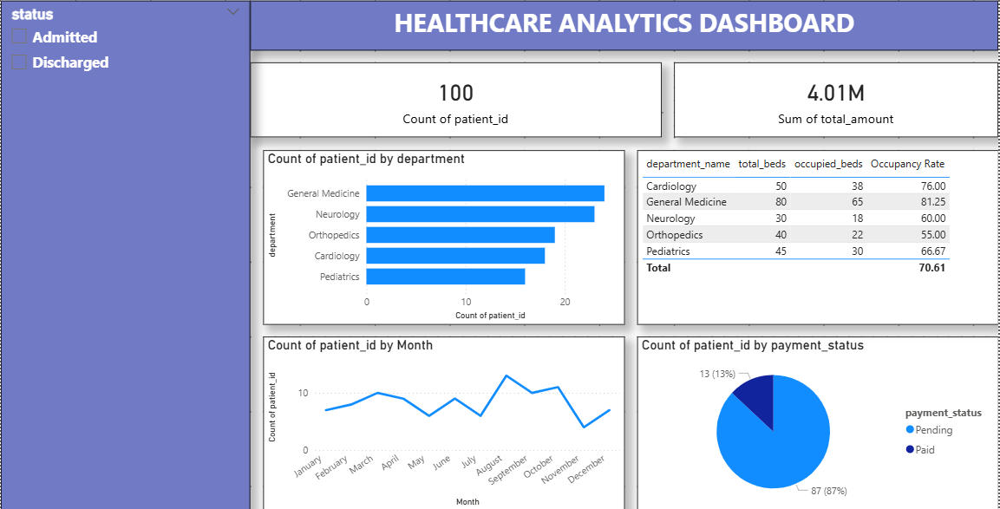

# 🏥 Healthcare Analytics Dashboard

## 📌 Project Overview
End to end data analytics project analyzing hospital patient data 
to derive insights on admissions, revenue, bed occupancy and doctor performance.

## 🛠️ Tools Used
| Tool | Purpose |
|---|---|
| Excel | Data Exploration & Cleaning |
| SQL (SSMS) | Business Queries |
| Python (Jupyter) | Data Cleaning & EDA |
| Power BI | Interactive Dashboard |

## 📊 Dashboard Preview


## 🔍 Key Business Questions Answered
1. Total patients admitted per department
2. Average bill amount per disease
3. Top 5 doctors by patient count
4. Monthly admission trends
5. Patients with pending payments
6. Bed occupancy rate per department
7. Average length of stay per disease

## 💡 Key Insights
- General Medicine has highest patient load (24%)
- 87% of payments are pending — major revenue risk
- Overall bed occupancy rate is 70.61%
- COVID-19 has highest average bill — ₹54,551
- Pneumonia is most common disease (23 patients)

## 📁 Files
| File | Description |
|---|---|
| Healthcare_Dataset.xlsx | Raw Dataset — 4 sheets |
| Healthcare_SQL_Queries.sql | 7 Business SQL Queries |
| Healthcare_Python_EDA.ipynb | Data Cleaning + 4 Charts |
| Healthcare_Dashboard.pbix | Power BI Dashboard |
| Dashboard_Preview.png | Dashboard Screenshot |
```

4. Commit message: `Added detailed README`
5. Click **Commit Changes** ✅

---

## Step 4 — Add Topics

1. On repo homepage click ⚙️ next to **About**
2. Add these topics:
```
power-bi, sql, python, excel, data-analytics, 
healthcare, dashboard, data-visualization
```
3. Click **Save Changes** ✅

---

## Step 5 — Verify Everything Looks Good

Your repo should show:
```
Healthcare-Analytics-Dashboard/
├── 📊 Dashboard_Preview.png
├── 📓 Healthcare_Python_EDA.ipynb
├── 📄 Healthcare_SQL_Queries.sql
├── 📈 Healthcare_Dashboard.pbix
├── 📋 Healthcare_Dataset.xlsx
└── 📝 README.md
